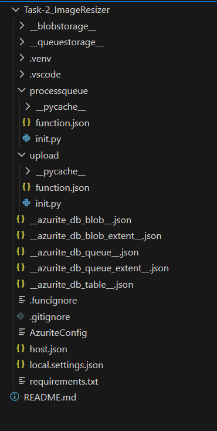
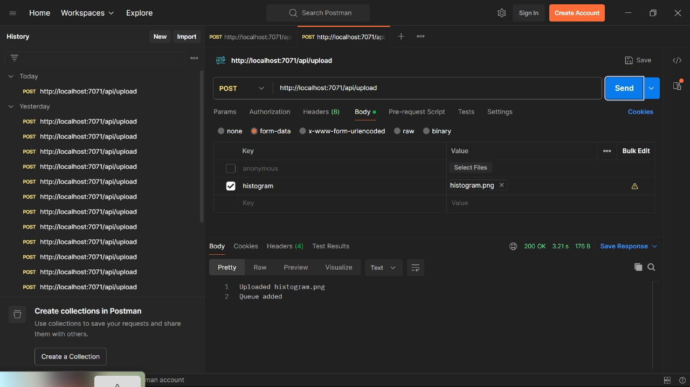

# Task 2 — Queue-Driven Image Resizer 

---

# **1. Problem Statement**

Whenever a user uploads an image through an HTTP endpoint:

1. The image must be stored in the **uploads** container.
2. A queue message must be generated with resizing instructions.
3. A **Queue-triggered Function** must:

   - Download the original image
   - Generate two resized versions (320px, 1024px)
   - Upload them to the **resized** container
   - Log the result in **function-logs** container

4. Error handling must retry processing up to 5 times.

---

# **2. Architecture Overview**

```
     [HTTP Upload]
           |
           v
   ┌──────────────────┐
   │ Upload Function   │
   │ (HTTP Trigger)    │
   └──────────────────┘
           |
     writes blob
           |
           v
   uploads/ container
           |
           |
   pushes queue message
           v
   ┌──────────────────┐
   │ Resize Function   │
   │ (Queue Trigger)   │
   └──────────────────┘
           |
           ├── resized/320/<guid>.jpg
           ├── resized/1024/<guid>.jpg
           |
           v
   logs outcome → function-logs/
```

---

# **3. Azure Resources Used**

| Resource                        | Purpose                         |
| ------------------------------- | ------------------------------- |
| **Azure Function App (Python)** | Runs upload + resize functions  |
| **Azure Storage Account**       | Blob + Queue storage            |
| **Blob Containers**             | uploads, resized, function-logs |
| **Queue**                       | image-jobs                      |

---

# **4. Project Structure**

```
Task-2_ImageResizer/
│
├── upload/
│   ├── __init__.py
│   └── function.json
│
├── processqueue/
│   ├── __init__.py
│   └── function.json
│
├── local.settings.json
└── host.json
```



---

# **5. Configuration**

### `local.settings.json`

```json
{
  "IsEncrypted": false,
  "Values": {
    "AzureWebJobsStorage": "<connection-string>",
    "FUNCTIONS_WORKER_RUNTIME": "python",
    "STORAGE_CONN": "<connection-string>"
  },
  "BlobContainers": {
    "Input": "uploads",
    "Output": "resized",
    "Logs": "function-logs"
  },
  "QueueConfig": {
    "ImageQueue": "image-jobs"
  }
}
```

---

# **6. Upload Function (HTTP Trigger)**

### **function.json**

```json
{
  "bindings": [
    {
      "authLevel": "anonymous",
      "type": "httpTrigger",
      "direction": "in",
      "name": "req",
      "methods": ["post"],
      "route": "upload"
    },
    {
      "type": "queue",
      "direction": "out",
      "name": "msg",
      "queueName": "image-jobs",
      "connection": "AzureWebJobsStorage"
    },
    {
      "type": "http",
      "direction": "out",
      "name": "$return"
    }
  ]
}
```

### **`upload/__init__.py`**

```python
import azure.functions as func
from azure.storage.blob import BlobServiceClient
import os
import json

def main(req: func.HttpRequest, msg: func.Out[str]) -> func.HttpResponse:
    try:

        file = req.files.get('file')
        if not file:
            return func.HttpResponse("No file uploaded.", status_code=400)


        blob_service = BlobServiceClient.from_connection_string(
            os.environ["STORAGE_CONN"]
        )


        input_container = os.environ.get("BlobContainers__Input", "uploads")

        container = blob_service.get_container_client(input_container)


        blob_client = container.get_blob_client(file.filename)
        blob_client.upload_blob(file.stream, overwrite=True)

        blob_url = blob_client.url

        message = {
            "blobUrl": blob_url,
            "sizes": [320, 1024]
        }

        msg.set(json.dumps(message))

        return func.HttpResponse(
            f"Uploaded successfully & job queued: {blob_url}",
            status_code=200
        )

    except Exception as e:
        return func.HttpResponse(str(e), status_code=500)

```

---

# **7. Process Queue Function (Image Resizer)**

### **function.json**

```json
{
  "bindings": [
    {
      "name": "msg",
      "type": "queueTrigger",
      "direction": "in",
      "queueName": "image-jobs",
      "connection": "AzureWebJobsStorage"
    }
  ]
}
```

### **`processqueue/__init__.py`**

```python
import azure.functions as func
from azure.storage.blob import BlobServiceClient
from urllib.parse import unquote
from PIL import Image
import io
import json
import uuid
import datetime
import os
import time

def main(msg: func.QueueMessage):
    start_time = time.time()

    conn_str = os.getenv("STORAGE_CONN")

    blob_service = BlobServiceClient.from_connection_string(conn_str)

    job = msg.get_json()
    blob_url = job["blobUrl"]
    sizes = job["sizes"]

    try:
        filename = unquote(blob_url.split("/")[-1])

        input_container = os.environ.get("BlobContainers__Input", "uploads")
        output_container = os.environ.get("BlobContainers__Output", "resized")
        log_container = os.environ.get("BlobContainers__Logs", "function-logs")

        source_blob = blob_service.get_blob_client(
            container=input_container,
            blob=filename
        )

        img_bytes = source_blob.download_blob().readall()
        original_img = Image.open(io.BytesIO(img_bytes))

        resized_urls = []

        for size in sizes:
            img_copy = original_img.copy()
            img_copy.thumbnail((size, size))

            buffer = io.BytesIO()
            img_copy.save(buffer, format="JPEG")
            buffer.seek(0)

            resized_blob = blob_service.get_blob_client(
                container=output_container,
                blob=f"{size}/{uuid.uuid4()}.jpg"
            )

            resized_blob.upload_blob(buffer, overwrite=True)
            resized_urls.append(resized_blob.url)

        log_data = {
            "original": blob_url,
            "resized": resized_urls,
            "processing_time": time.time() - start_time,
            "status": "success",
            "timestamp": str(datetime.datetime.utcnow())
        }

        log_blob = blob_service.get_blob_client(
            container=log_container,
            blob=f"ImageResizer/{datetime.date.today()}/{uuid.uuid4()}.json"
        )

        log_blob.upload_blob(json.dumps(log_data), overwrite=True)

    except Exception as e:
        if msg.dequeue_count >= 5:
            error_log = {
                "original": blob_url,
                "error": str(e),
                "status": "failed-after-retries",
                "timestamp": str(datetime.datetime.utcnow())
            }

            log_blob = blob_service.get_blob_client(
                container=log_container,
                blob=f"ImageResizer/{datetime.date.today()}/{uuid.uuid4()}.json"
            )

            log_blob.upload_blob(json.dumps(error_log), overwrite=True)
            return

        raise e

```

---

# **8. How to Test**

### **Run locally**

```
func start
```


### **Upload image (Postman)**

```
POST http://localhost:7071/api/upload
Body → form-data → file → <select image>
```

### Expected output

✔ 200 OK
✔ Message added to queue
✔ resized/320/_.jpg and resized/1024/_.jpg created
✔ Log written into function-logs



---

# **9. Retry & Error Handling**

| Scenario          | Behaviour                                     |
| ----------------- | --------------------------------------------- |
| Temporary failure | Function retries automatically                |
| Permanent failure | After 5 retries → logs error to function-logs |
| Missing file      | Logged as failure                             |

---

# **10. Conclusion**

✔ HTTP upload endpoint
✔ Uploads image to blob storage
✔ Queue-driven processing
✔ Image resizing logic (320px & 1024px)
✔ Resized outputs saved
✔ Logging system implemented
✔ Retry logic implemented

---
