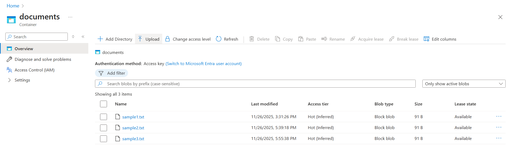
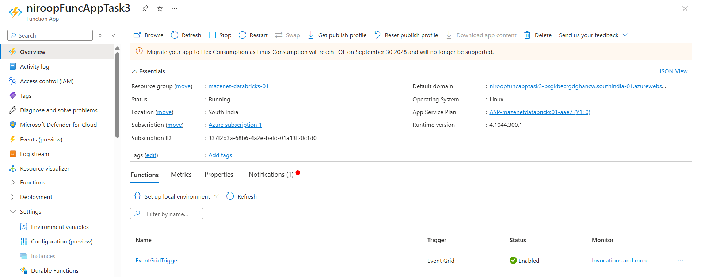
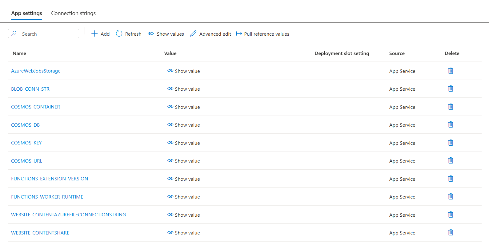
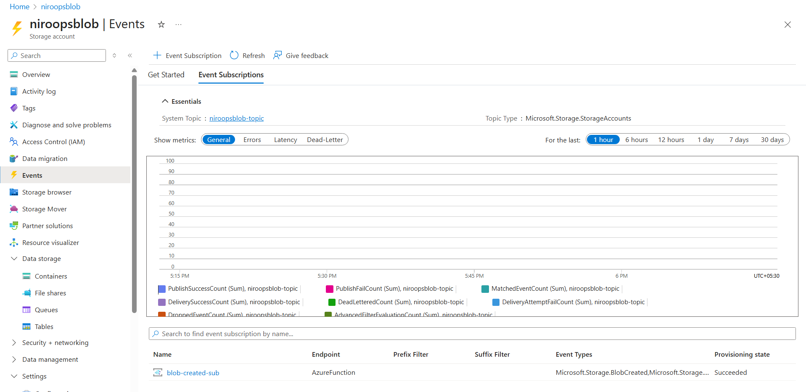
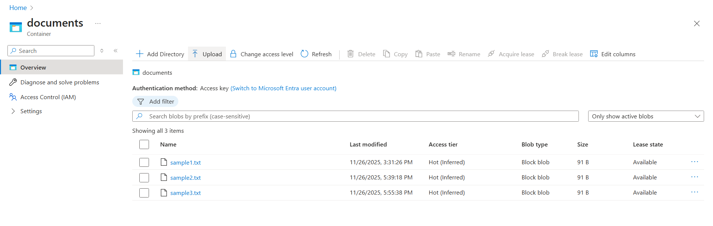
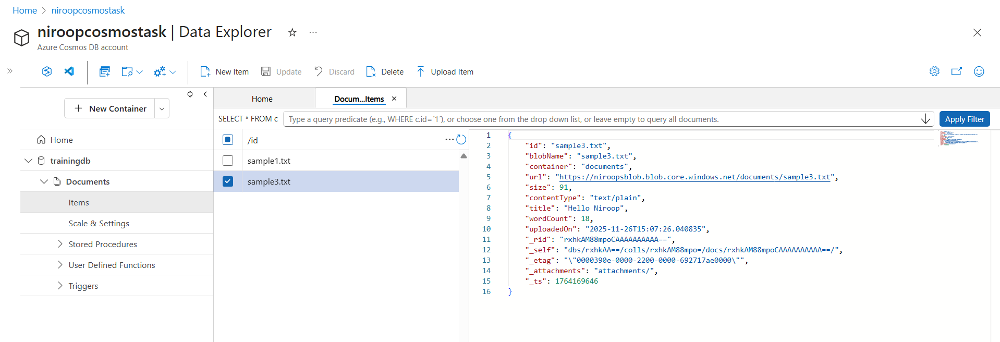

# ** Task 3 : Blob Metadata Indexing with Azure Function, Event Grid & Cosmos DB**

This project demonstrates an automated serverless pipeline using **Azure Functions**, **Event Grid**, **Blob Storage**, and **Azure Cosmos DB**.
Whenever a new blob is uploaded to a storage container, an **Event Grid Trigger** automatically extracts the blob's metadata and stores it in **Cosmos DB**.

---

## **Architecture Overview**

1. A blob is uploaded to the **documents** container in Azure Blob Storage.
2. **Event Grid** detects the `BlobCreated` event.
3. Event Grid invokes the **Azure Function (EventGridTrigger)**.
4. The function fetches the blob's properties using Blob SDK.
5. Metadata is **inserted into Cosmos DB** as a document.

**(Screenshot Placeholder #1: High-level project diagram)**

---

# **Technologies Used**

- Azure Functions (Python)
- Azure Blob Storage
- Azure Event Grid
- Azure Cosmos DB (Core SQL API)
- Python SDKs

  - `azure-functions`
  - `azure-storage-blob`
  - `azure-cosmos`

---

# **Project Structure**

```
Task3_IndexBlobMetadata/
│── function_app.py
│── host.json
│── requirements.txt
│── local.settings.json (local development only)

```

# **Azure Setup Instructions**

## **Step 1 — Create Azure Blob Storage**

- Create a **Storage Account**
- Add a container named **documents**
- Set access type: _Private_


**(Screenshot Placeholder #2: Storage account + documents container view)**

---

## **Step 2 — Create Azure Cosmos DB**

- Create Cosmos DB Account (Core SQL API)
- Create:

  - Database: `trainingdb`
  - Container: `Documents`
  - Partition Key: `/id`

**(Screenshot Placeholder #3: Cosmos DB → Data Explorer → trainingdb/Documents)**

---

## **Step 3 — Deploy the Azure Function**

deployed manually:


## 

Then configure **Application Settings**:

| Setting          | Description               |
| ---------------- | ------------------------- |
| BLOB_CONN_STR    | Storage connection string |
| COSMOS_URL       | Cosmos DB endpoint        |
| COSMOS_KEY       | Primary key               |
| COSMOS_DB        | trainingdb                |
| COSMOS_CONTAINER | Documents                 |


**(Screenshot Placeholder #4: Azure Function → Environment Variables page)**

---

## **Step 4 — Create Event Grid Subscription**

Under **Storage Account → Events → + Event Subscription**:

- Name: `blob-created-sub`
- Event Schema: Event Grid Schema
- Event Types:
  ✔ BlobCreated
  ✔ BlobCreatedWithVersion
- Endpoint Type: Azure Function
- Select function: `EventGridTrigger`



**(Screenshot Placeholder #5: Event Grid subscription creation screen)**

---

# Testing the Pipeline (Cloud)

### Upload a file to Blob Storage

Example: `sample3.txt`



**(Screenshot Placeholder #6: Uploaded blob list including sample3.txt)**

### Check Cosmos DB

You should see a new document:



**(Screenshot Placeholder #7: Cosmos DB document auto-created for sample3.txt)**

---

# **Expected Output**

A document stored in Cosmos DB:

```json
{
  "id": "sample3.txt",
  "blobName": "sample3.txt",
  "container": "documents",
  "url": "https://<storage>.blob.core.windows.net/documents/sample3.txt",
  "type": "BlockBlob",
  "size": 91,
  "contentType": "text/plain",
  "title": "Hello Niroop",
  "wordCount": 18,
  "uploadedOn": "2025-11-26T12:25:38.040835+00:00",
  "etag": "\"0x8D...\""
}
```

# **Conclusion**

This project fully automates blob metadata extraction using a serverless design.
It integrates seamlessly with Cosmos DB for storage.

---
