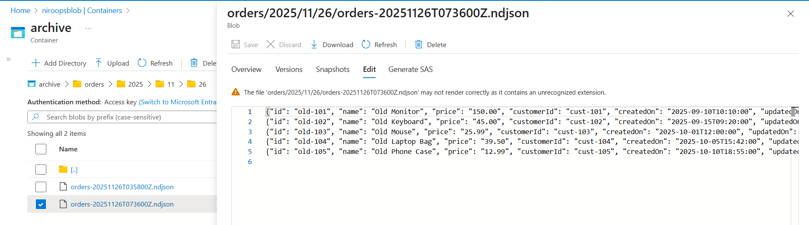
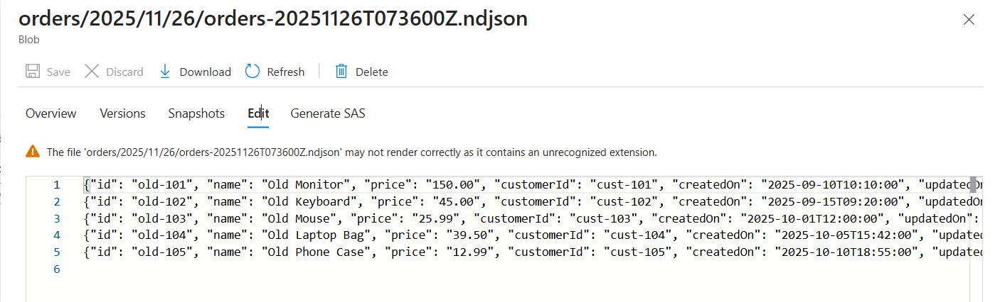
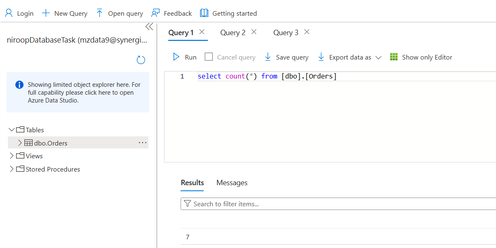
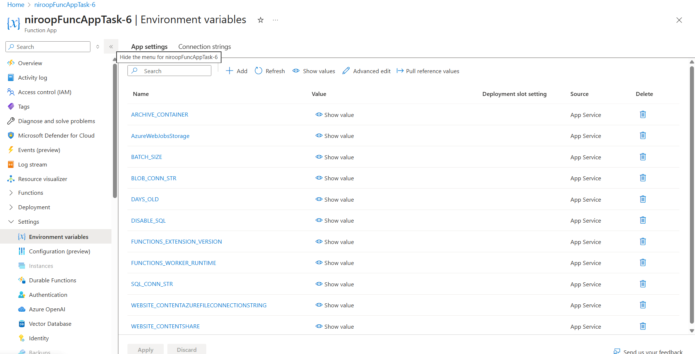
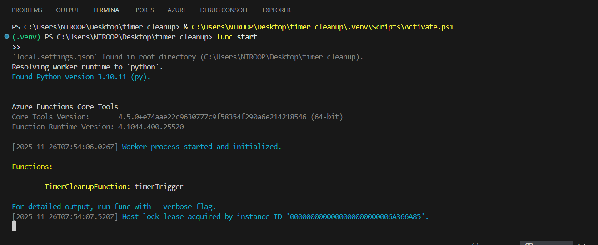
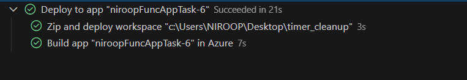
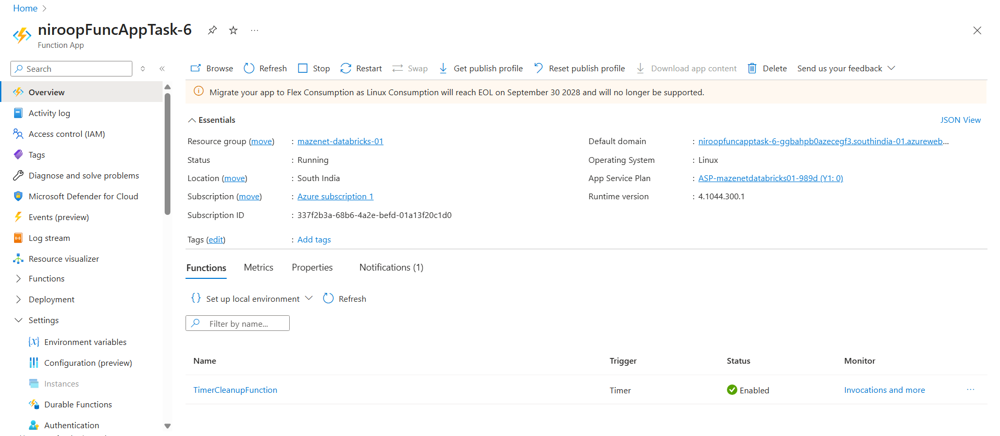

# Task 6 – Azure Function: Orders Cleanup & Archival (Timer Trigger)

This task implements an automated cleanup and archival process using **Azure Functions**, **Azure SQL Database**, and **Azure Blob Storage**.
A TimerTrigger function runs on a schedule, identifies old Orders from the SQL database, archives them as NDJSON files in Blob Storage, and then deletes those archived rows from SQL.
---

## Overview of the Task

1. Connect to Azure SQL Database
2. Select orders older than _N_ days
3. Convert them to **NDJSON (newline-delimited JSON)**
4. Upload the archive file to Azure Blob Storage under a date-based folder structure
5. Delete the archived records from the Orders table
6. Run automatically on a timer schedule

---

## Architecture Flow

```
Azure Function (Timer Trigger)
        │
        ├── Fetch old records from Azure SQL
        │
        ├── Convert to NDJSON
        │
        ├── Upload NDJSON → Azure Blob Storage (/orders/YYYY/MM/DD/)
        │
        └── Delete archived rows from SQL
```

---

## Timer Trigger Schedule

The schedule is configured in `function.json`:

```json
"schedule": "0 0 2 * * *"
```

This means: **Runs every day at 02:00:00 AM UTC** (can be changed as needed).

---

## Blob Storage Folder Structure

Archived records are stored under:

```
archive/
 └── orders/
     └── YYYY/
         └── MM/
             └── DD/
                 └── orders-<timestamp>.ndjson
```

### _ Blob Container Structure_



---

## NDJSON Format

Sample content inside the generated file:

```json
{"id": "o-old-001", "name": "Old Order A", ...}
{"id": "o-old-002", "name": "Old Order B", ...}
{"id": "o-old-003", "name": "Old Order C", ...}
```

Each line represents a single order record.

### _ NDJSON File Preview_



---

## SQL Table Before and After Cleanup

The function removes all records older than `DAYS_OLD` days (default = 30).
After the function runs, remaining rows = only recent orders.

### _ SQL Row Count Before & After_

Before:


After:



---

## Required Azure App Settings

Go to:

**Function App → Settings → Enviroment variables → App settings**

Add or confirm:

| Key                   | Example Value                        |
| --------------------- | ------------------------------------ |
| `SQL_CONN_STR`        | ODBC connection string for Azure SQL |
| `BLOB_CONN_STR`       | Storage account connection string    |
| `ARCHIVE_CONTAINER`   | archive                              |
| `BATCH_SIZE`          | 1000                                 |
| `DAYS_OLD`            | 30                                   |
| `DISABLE_SQL`         | false                                |
| `AzureWebJobsStorage` | auto-generated                       |

### _ App Settings in Azure_



---

## Code Summary (Main Highlights)

### 🔹 Fetch old rows

```python
rows = fetch_batch(cursor, BATCH_SIZE, DAYS_OLD)
```

### 🔹 Write NDJSON to temp file

```python
tmpf.write(json.dumps(r) + "\n")
```

### 🔹 Upload to Azure Blob Storage

```python
blob_client.upload_blob(data, overwrite=True)
```

### 🔹 Delete archived rows from SQL

```python
cursor.execute("DELETE FROM Orders WHERE id IN (?)", ids_chunk)
```

---

## Local run



---

## Deployment

Publish to Azure:





---
