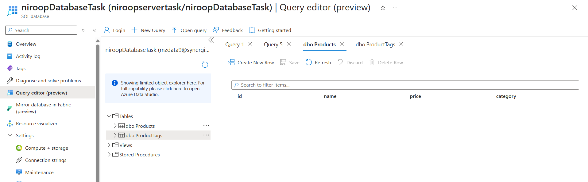
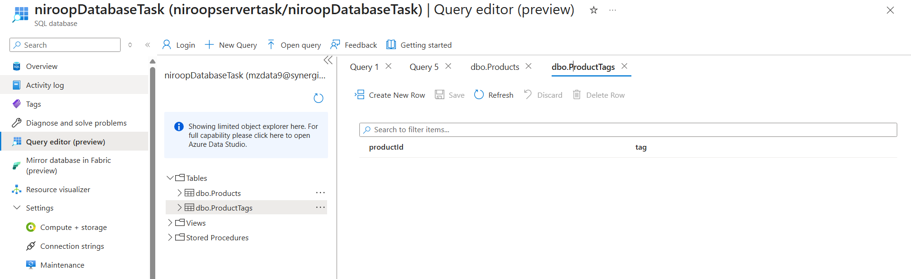
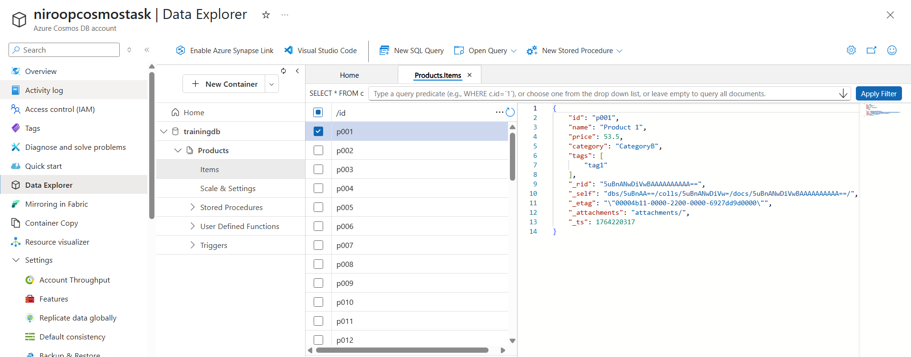
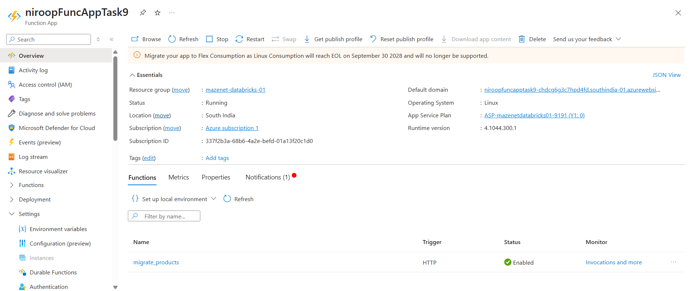
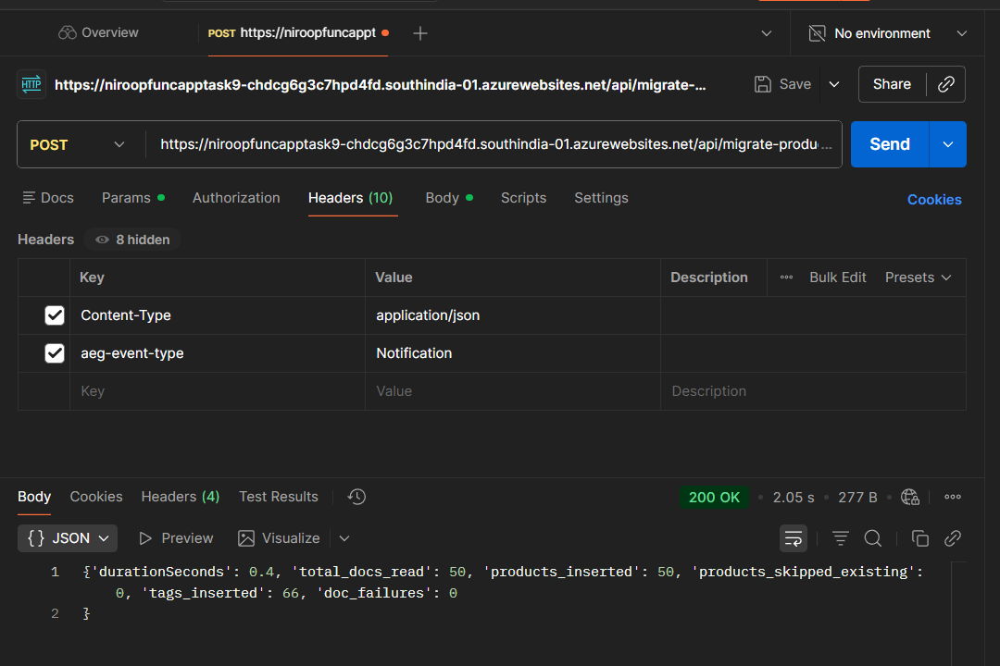
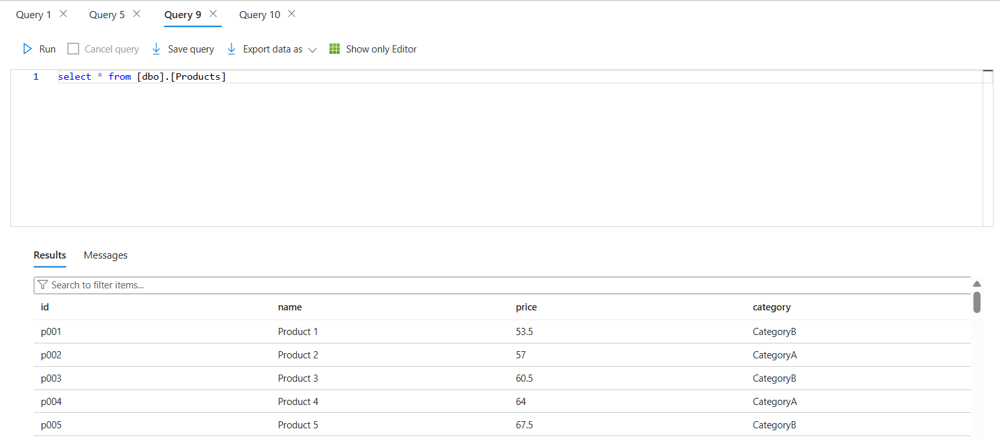
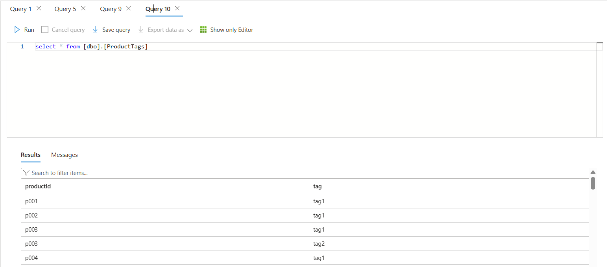

# Task 9 — Cosmos DB ➝ Azure SQL Data Migration

This task implements a one-time **data migration pipeline** using an **HTTP-triggered Azure Function**.
The function reads product documents from **Azure Cosmos DB**, transforms them, flattens nested arrays, and writes them into **Azure SQL Database** using batched inserts.

---

# **1. Problem Statement**

Whenever required, migrate all documents from a Cosmos DB **Products** container into Azure SQL tables.

The function must:

- Read all documents from Cosmos DB
- Map JSON → relational schema
- Flatten the `tags[]` array into a child table
- Insert into `Products` and `ProductTags` tables
- Handle Cosmos continuation tokens
- Handle throttling & batching
- Produce a migration report

---

# **2. Architecture Overview**

```
Cosmos DB (Products)
        |
        v
Azure Function (HTTP Trigger)
  - Reads with continuation token
  - Transforms product JSON
  - Inserts into SQL (Products, ProductTags)
        |
        v
Azure SQL Database
```

---

# **3. Azure Resources Used**

| Resource                        | Purpose                    |
| ------------------------------- | -------------------------- |
| **Cosmos DB (SQL API)**         | Source documents           |
| **Azure SQL Database**          | Target relational tables   |
| **Azure Function App (Python)** | Executes migration         |
| **Postman / HTTP call**         | Trigger migration manually |






---

# **4. Cosmos DB Source Structure (Sample Document)**

Each product document looks like:

```json
{
  "id": "p001",
  "name": "Product 1",
  "price": 53.5,
  "category": "CategoryA",
  "tags": ["tag1", "tag2"]
}
```



---

# **5. SQL Target Schema**

### **Products Table**

| Column   | Type                     |
| -------- | ------------------------ |
| id       | NVARCHAR(50) PRIMARY KEY |
| name     | NVARCHAR(200)            |
| price    | FLOAT                    |
| category | NVARCHAR(100)            |

### **ProductTags Table**

| Column    | Type          |
| --------- | ------------- |
| productId | NVARCHAR(50)  |
| tag       | NVARCHAR(100) |

---

# **6. Local Development**

### **Install Dependencies**

```
pip install -r requirements.txt
```

### **Run Locally**

```
func start
```


---

# **7. Azure Function — HTTP Endpoint**

```
POST https://<functionapp>.azurewebsites.net/api/migrate-products?code=<function-key>
```



---

# **8. Migration Flow**

1. Connect to Cosmos DB
2. Fetch documents in batches
3. Use continuation token until all pages are read
4. Insert into SQL Products table (skip if exists)
5. Insert tags into SQL ProductTags table
6. Track report counters
7. Return JSON summary

---

# **9. Running Migration from Azure (Postman Test)**

### **POST Request Example**

```
POST https://<functionapp>.azurewebsites.net/api/migrate-products?code=<your-function-key>
```



### **Sample Success Output**

```json
{
  "durationSeconds": 0.4,
  "total_docs_read": 50,
  "products_inserted": 50,
  "products_skipped_existing": 0,
  "tags_inserted": 66,
  "doc_failures": 0
}
```

---

# **10. SQL Verification**

### Query:

```sql
SELECT * FROM dbo.Products;
SELECT * FROM dbo.ProductTags;
```





---

# **11. Migration Report Contents**

The migration returns:

- **total_docs_read** — number of documents in Cosmos
- **products_inserted** — new entries added to SQL
- **products_skipped_existing** — duplicates skipped
- **tags_inserted** — flattened tag rows
- **doc_failures** — failed items
- **durationSeconds** — total execution time

---

# **12. Error Handling & Throttling**

- Uses Cosmos continuation tokens
- Uses try/except blocks
- Skips duplicates with SQL SELECT EXISTS()
- Batch insert reduces SQL round-trips

---

# **13. Conclusion**

✔ Migration completed successfully
✔ Cosmos DB documents transformed and inserted into SQL
✔ Tags flattened into relational rows
✔ Function tested locally & on Azure

---
